# Мобильный робот с манипулятором в ROS 2

Проект посвящён моделированию мобильного робота с манипулятором, разработке системы управления, мониторинга и автономной навигации в среде ROS 2.

Робот моделируется в складской среде Gazebo и использует LiDAR, камеру, одометрию, SLAM и Navigation2 для исследования окружающей среды и автономного движения.

Для управления основными режимами работы и мониторинга состояния ROS 2-системы также разработан графический интерфейс.

---

## Модель робота и среда моделирования

Мобильный робот состоит из колёсной платформы и установленного на ней манипулятора.

Моделирование выполняется в складской среде Gazebo, содержащей стеллажи, стены, оборудование и другие объекты.

В модели используются:

- мобильная колёсная платформа;
- манипулятор;
- LiDAR;
- дополнительные лазерные датчики;
- камера;
- датчики состояния колёс и суставов.

### Модель робота в Gazebo

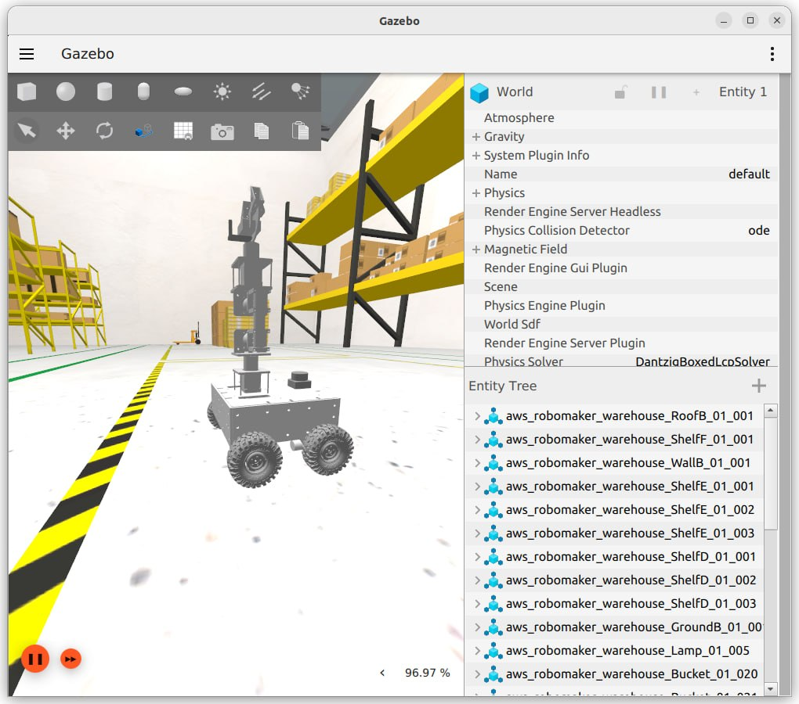

*Модель мобильного робота с манипулятором в складской среде Gazebo.*

---

## Основные возможности

В проекте реализованы:

- ручное управление мобильной платформой;
- получение и обработка данных LiDAR;
- получение изображения с камеры;
- вычисление одометрии;
- TF-преобразования между системами координат;
- построение карты с помощью SLAM;
- сохранение созданной карты;
- локализация робота на готовой карте;
- автономная навигация с использованием Nav2;
- планирование маршрута между точками;
- автономное движение из начальной точки в заданную точку;
- обнаружение препятствий;
- корректировка движения при обнаружении препятствий;
- визуализация состояния системы в RViz2;
- графический интерфейс управления системой;
- переключение между ручным и автономным режимами;
- мониторинг состояния ROS 2-компонентов и узлов;
- визуализация архитектуры системы и потоков данных.

---

## Графический интерфейс управления и мониторинга

Для упрощения запуска и управления системой разработан графический интерфейс.

Через основной интерфейс можно запускать и останавливать симуляцию, переключаться между ручным и автономным режимами, открывать управление роботом, работать с картами и просматривать изображение с камеры.

### Основная панель управления

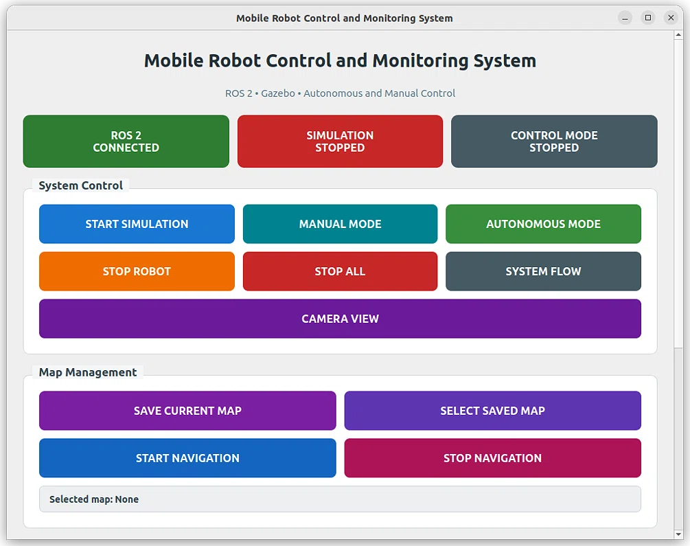

*Главное окно графического интерфейса для запуска симуляции, выбора режима работы, управления картами и доступа к основным функциям системы.*

### Ручное управление

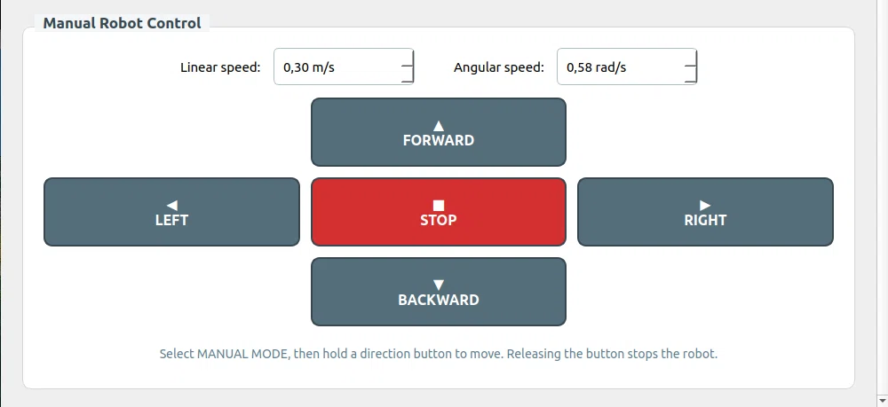

*Интерфейс ручного управления мобильным роботом с командами движения вперёд, назад, влево и вправо.*

### Архитектура ROS 2-системы

Для мониторинга системы также реализовано окно визуализации архитектуры ROS 2 и потоков данных между основными компонентами.

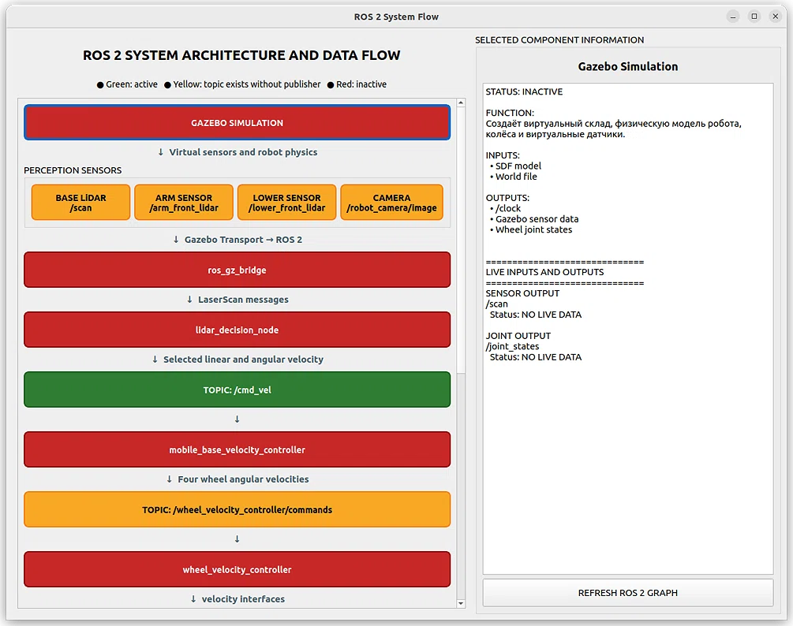

*Визуализация основных компонентов ROS 2-системы, последовательности обработки данных и состояния выбранного узла.*

### Мониторинг ROS 2-узлов

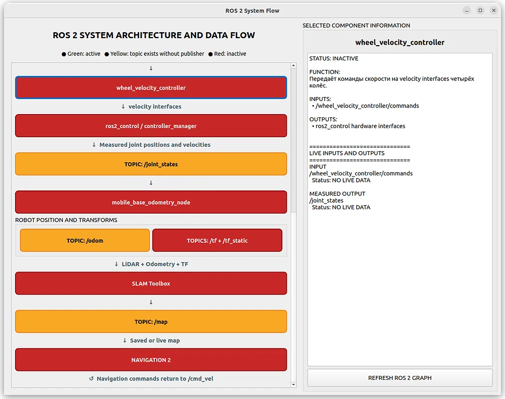

*Интерфейс позволяет выбирать отдельные компоненты системы и просматривать информацию об их состоянии и роли в архитектуре робота.*

---

## SLAM и построение карты

Для построения карты используется SLAM Toolbox.

LiDAR передаёт информацию о расстоянии до окружающих объектов. Система совместно использует данные лазерного сканирования, одометрию и TF-преобразования для определения положения робота и построения карты складской среды.

На начальном этапе робот перемещается по складской среде, а карта постепенно формируется в RViz2.

### Начало построения карты

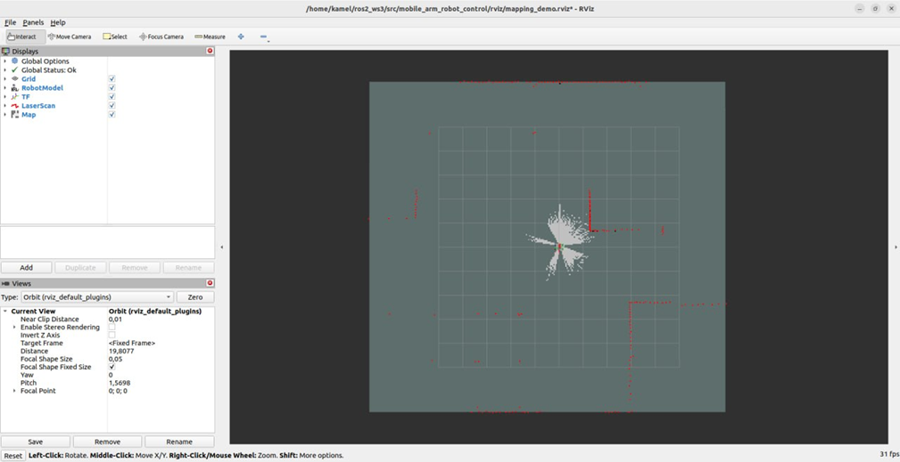

*Начальный этап SLAM: робот перемещается по среде и постепенно строит карту.*

---

## Камера робота

Камера используется для получения изображения окружающей среды непосредственно с мобильного робота.

Изображение публикуется через ROS 2 и может отображаться с помощью инструментов визуализации ROS.

### Изображение с камеры

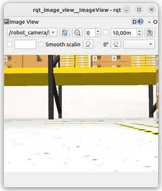

*Получение изображения окружающей среды с камеры мобильного робота.*

---

## Завершение построения карты

После исследования складской среды формируется более полная карта окружающего пространства.

Полученная карта сохраняется и в дальнейшем используется для локализации робота и автономной навигации.

### Построенная карта складской среды

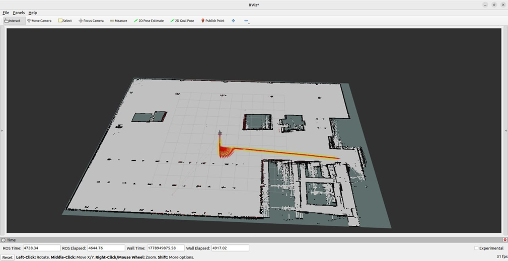

*Результат построения карты складской среды с использованием SLAM Toolbox.*

---

## Автономная навигация

Для автономной навигации используется ROS 2 Navigation2 (Nav2).

После загрузки сохранённой карты и определения положения робота пользователь может задать целевую точку в RViz2.

Система выполняет следующие этапы:

**Текущее положение → задание цели → планирование маршрута → автономное движение → достижение цели**

Nav2 рассчитывает маршрут от текущего положения робота до заданной цели и формирует команды движения мобильной платформы.

Во время движения положение робота постоянно обновляется, а система навигации корректирует движение с учётом окружающей среды до достижения заданной цели.

### 1. Исходное положение робота

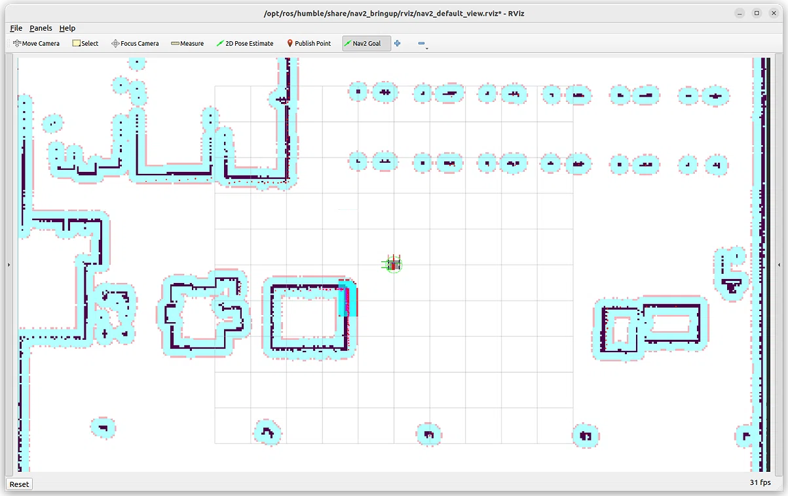

*Робот локализован на сохранённой карте перед заданием новой целевой точки.*

### 2. Задание целевой точки и построение маршрута

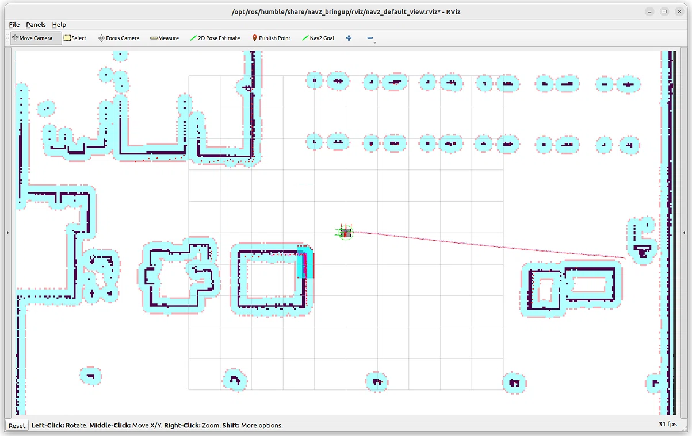

*Пользователь задаёт целевую точку в RViz2, после чего Navigation2 рассчитывает маршрут от текущего положения робота до цели.*

### 3. Автономное движение и достижение цели

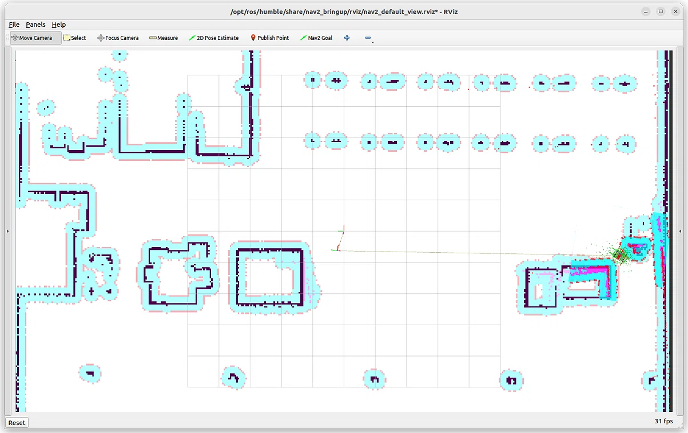

*После построения маршрута робот автономно перемещается из начальной позиции и достигает заданной целевой точки.*

---

## Обнаружение препятствий

Для обработки данных LiDAR реализован отдельный ROS 2 узел:

`lidar_decision_node`

Узел анализирует расстояния до окружающих объектов и принимает решение о дальнейшем движении мобильной платформы.

В зависимости от расстояния до препятствия робот может:

- продолжать движение вперёд;
- уменьшать скорость;
- остановиться;
- выполнить поворот для предотвращения столкновения.

Команды движения передаются через топик:

`/cmd_vel`

---

## Ручное управление

Кроме автономного режима, робот может управляться вручную с клавиатуры или через графический интерфейс.

Для запуска ручного управления используется:

```bash
./teleop1_robot_1.sh
```

Команды управления преобразуются в сообщения ROS 2 и передаются контроллеру мобильной платформы.

---

## Структура проекта

Проект разделён на несколько ROS 2 пакетов.

### `mobile_arm_robot_description`

Содержит:

- модель робота;
- URDF/SDF;
- meshes;
- модели датчиков;
- складскую среду Gazebo.

### `mobile_arm_robot_control`

Содержит:

- контроллеры движения;
- управление колёсами;
- одометрию;
- конфигурацию SLAM и других компонентов системы управления.

### `mobile_arm_robot_autonomy`

Содержит:

- алгоритмы автономного поведения;
- обработку данных LiDAR;
- `lidar_decision_node`.

### `mobile_arm_robot_navigation`

Содержит:

- конфигурацию Nav2;
- карты;
- параметры навигации;
- запуск автономной навигации.

### `mobile_arm_robot_gui`

Содержит графический интерфейс для:

- запуска и остановки компонентов системы;
- выбора режима управления;
- ручного управления роботом;
- работы с картами;
- доступа к камере;
- мониторинга архитектуры ROS 2;
- просмотра состояния отдельных компонентов системы.

---

## Запуск проекта

Проект разработан для ROS 2 Humble.

Сначала необходимо перейти в workspace и собрать проект:

```bash
cd ~/ros2_ws3_1
source /opt/ros/humble/setup.bash
colcon build --symlink-install
source install/setup.bash
```

### Запуск основной симуляции

```bash
./demo_robot_1.sh
```

### Ручное управление

```bash
./teleop1_robot_1.sh
```

### Автономный режим

```bash
./autonomy_robot_1.sh
```

### Автономная навигация

Для запуска навигации с сохранённой картой:

```bash
ros2 launch mobile_arm_robot_navigation warehouse_full_navigation.launch.py map:=$(pwd)/maps/2.yaml
```

### Камера

```bash
./kamera_robot_1.sh
```

---

## Результаты

В ходе работы были реализованы и проверены:

- моделирование мобильного робота с манипулятором в Gazebo;
- движение мобильной платформы;
- ручное управление;
- работа LiDAR;
- работа камеры;
- получение одометрии;
- TF-преобразования;
- построение карты складской среды;
- сохранение построенной карты;
- локализация робота на готовой карте;
- планирование маршрута;
- автономное движение из одной точки в другую;
- обнаружение препятствий;
- работа Navigation2;
- визуализация системы в RViz2;
- графический интерфейс управления системой;
- мониторинг основных ROS 2-компонентов и узлов.

В результате робот может исследовать складскую среду, построить и сохранить её карту, локализоваться на готовой карте и автономно перемещаться из текущего положения к заданной целевой точке.

Графический интерфейс позволяет управлять основными режимами системы и контролировать работу её компонентов.

Мобильная платформа и система автономной навигации реализованы и протестированы в среде моделирования.

Манипулятор уже включён в модель робота, однако полноценное управление его суставами является следующим этапом проекта.

В дальнейшем также планируется устранить обнаруженные ошибки, улучшить стабильность системы и продолжить развитие функциональности робота.

---

## Используемые технологии

- ROS 2 Humble
- Gazebo / Ignition Gazebo
- RViz2
- Navigation2 (Nav2)
- SLAM Toolbox
- ros2_control
- Python
- C++
- Ubuntu Linux

---

## Дальнейшее развитие

Следующие этапы проекта:

- разработка полноценного управления манипулятором;
- настройка движения суставов манипулятора;
- исправление обнаруженных ошибок;
- повышение стабильности системы;
- улучшение алгоритмов обнаружения и объезда препятствий;
- использование компьютерного зрения;
- интеграция автономной навигации и манипулятора;
- развитие системы для работы с несколькими мобильными роботами;
- перенос разработанных алгоритмов на реального робота.
